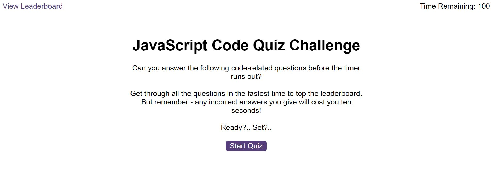
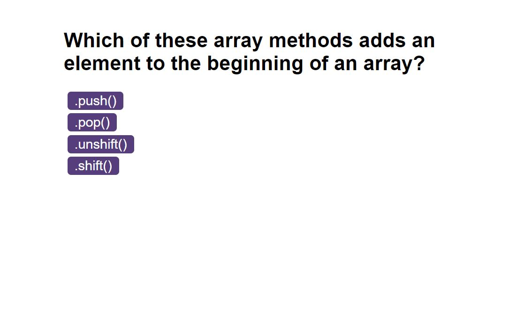
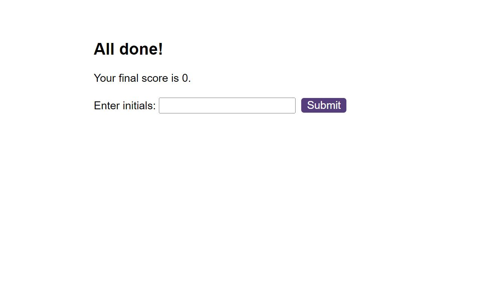
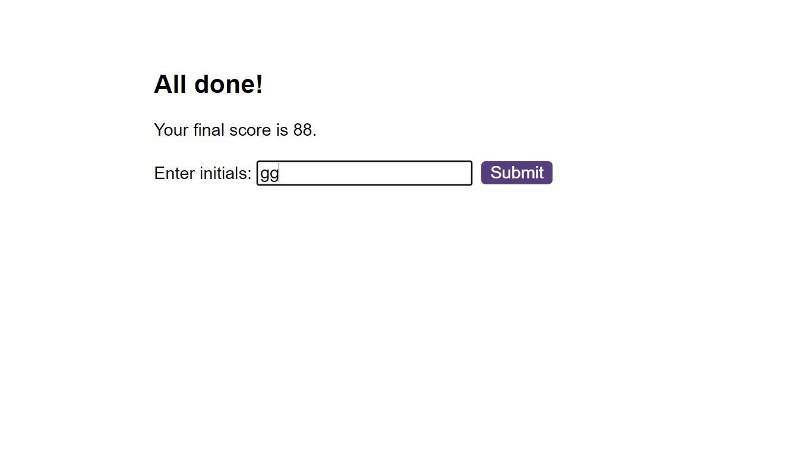
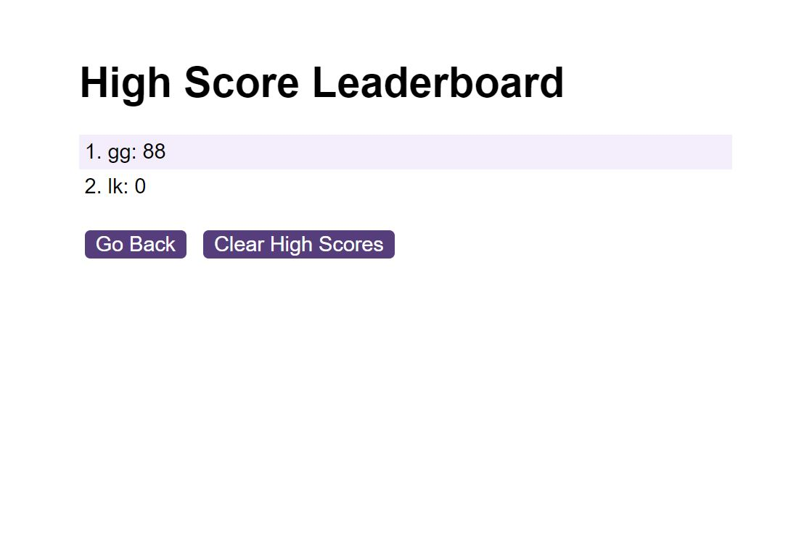
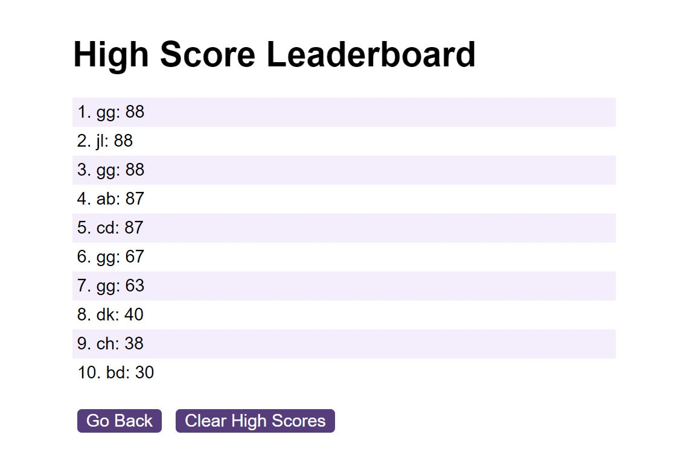
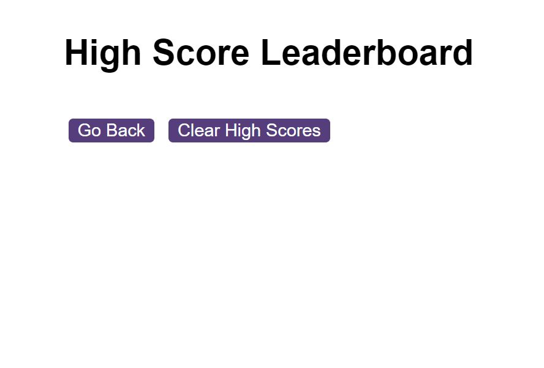

# Javascript Code Quiz

## Description

This project involved building a timed Coding Quiz game with multiple choice questions based on JavaScript fundamentals. 

The application was created to run in the browser, and features dynamically updated HTML and CSS powered by JavaScript code. It has the following requirements:

- A start screen with a start button which, when clicked, starts a timer and causes the first question to appear;

- Questions should be accompanied by multiple choice options which will be represented by buttons. When clicked, the buttons should move to the next question;

- Any incorrect answers chosen subtract a set amount of time from the timer;

- The quiz should end when all questions are answered or the timer reaches 0;

- When the game ends, the user's score should be displayed along with an allowance for the user to save their initials and score. 

## Installation  

The application, linked below, was deployed using GitHub Pages. 

Simply upload the index.html and license.txt files, along with the assets folder which contains three JavaScript files, a CSS file and an images folder, to the desired webserver.

## Usage

[Link to the deployed JavaScript Code Quiz application on GitHub Pages](https://ccmong.github.io/javascript-code-quiz/)

[Link to the GitHub code repository](https://github.com/CcMong/javascript-code-quiz)

The user will be expected to answer 10 questions in 100 seconds. The user begins by clicking the "Start Quiz" button, which starts the timer and brings up the first question with multiple choice options. 

Clicking an answer will provide instant feedback as to whether the answer is right or wrong, and the user will immediately be sent to the next question. For every wrong answer, 10 seconds will be deducted from the time remaining.

The time remaining constitutes the user's score at the end. Failure to complete the 10 questions before the time runs out results in zero points scored.

The user, at the end of the quiz, will be able to submit and save their initials along with their score.

This will show up on the next screen, on the High Score Leaderboard.

Only the top 10 high scores will be shown on the leaderboard.

The user has the option of clicking "Go Back" to retake the quiz, and the leaderboard can be cleared by clicking "Clear High Scores".

The same set of questions is asked every time the quiz is run, but the game is designed to deliver them in a different order. There is scope to increase the number of questions at a later point.

## Credits

N/A

## License

MIT License.

Please refer to the LICENSE in the repo.

## Badges  

